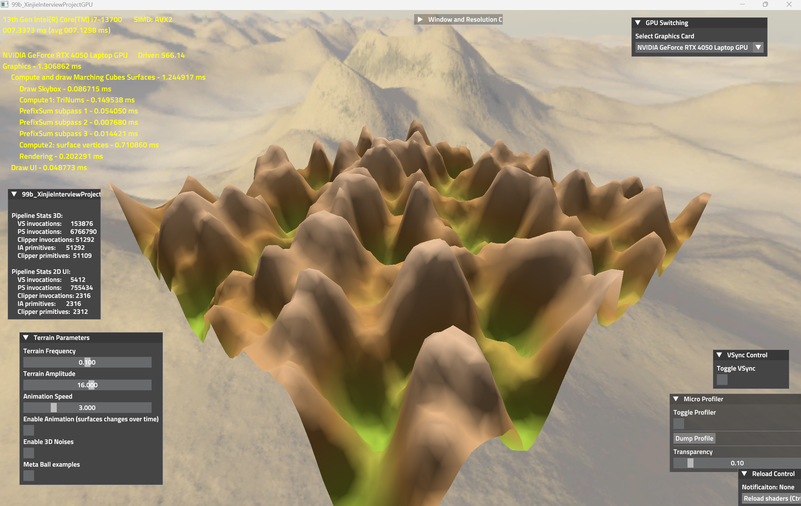
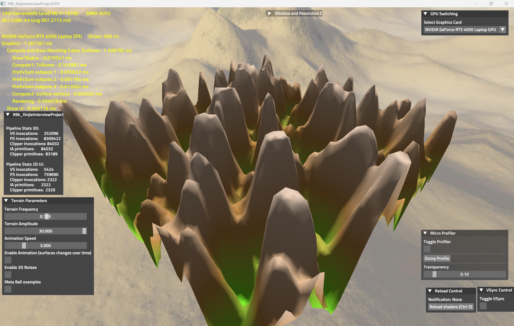
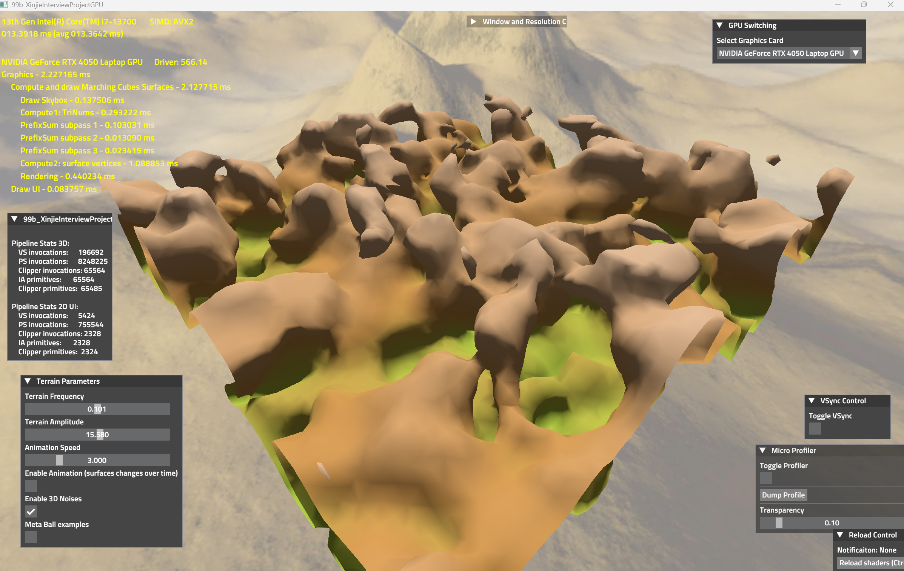
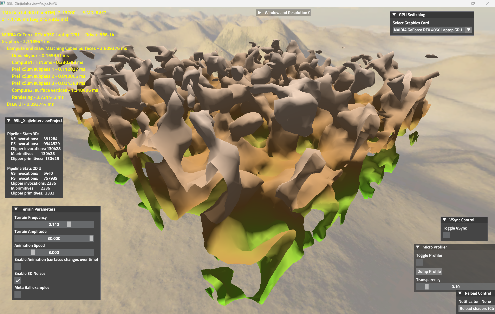

# Real Time Marching Cubes with Compute Shaders
## Author: Xinjie Zhu
### Project Description

This graphics program fully implemented Marching Cubes on the GPU using compute shaders, and parallelizing the algorithm by each voxel. The algorithm is run parallelly on GPU every frame. It can be dynamically updated with adjustable frequency, amplitude and time parameters. Using both 2D terrain height map and 3D volumetric terrain surfaces for real time demo. The metaballs in the demo is for fun. The GPU indirect drawing is also used in the program for performance and avoiding synchronization or aliasing problem.  

The GPU prefix sum compute pipeline is also implemented in the project, since each thread (voxel) need to know where they should place the triangle data of this voxel inside the triangle buffer. Therefore the prefix sum of triangle count of each voxel need to be computed by the GPU prefix sum pipeline. 

I implemented this program using The-Forge, a low-level graphics framework that is written by Vulkan, DirectX 12, and Metal for cross-platform rendering. The-Forge provides finer control over GPU operations compared to higher-level APIs like OpenGL and DirectX 11, making it more complex but also more powerful for optimizing performance and rendering technique. 

The C++ code and compute shader code of real time marching cubes are under the "Real-Time-MarchingCubes" folder. I also try the CPU octree marching cubes rendering in The-Forge Framework for the learning puropse and getting familiar with framework.  

 <a href="https://drive.google.com/file/d/1c6Ln3WxlWdGGZn3jcD9Kok3BC9Fe8U13/view?usp=sharing" table = "_blank"> Demo Video Link (Click here)</a>
 

 ### Terrain Height Map Example 

  
  
   

  ### Terrain Height Map with High Amplitude

 
  
   

 ### 3D Volumetric Terrain Surface Example

 
  
   

 ### 3D Volumetric Terrain Surface with high frequency and amplitude

   
    
     